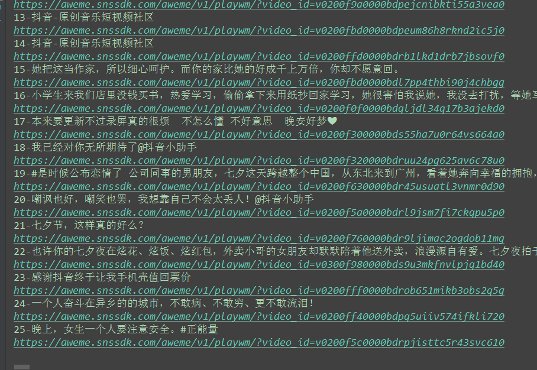

抖音APP视频下载 
===========================
 
### 抖音APP官网 - https://www.douyin.com/
|Author|:sunglasses:Henryhaohao:sunglasses:|
|---|---
|Email|:hearts:1073064953@qq.com:hearts:

    
****
## :dolphin:声明
软件均仅用于学习交流，请勿用于任何商业用途！感谢大家！
## :dolphin:介绍
该项目为[抖音APP](https://www.douyin.com/)视频下载
- 项目介绍:通过传入抖音作者的UserID爬取其作者的喜欢(别人的视频)或者发布(自己上传的视频)
- 爬虫文件:Spiders目录下的douyin_video.py
- 运行方法:传入抖音作者的UserID即可开始下载视频,下载的视频将存放在项目目录下的douyin_video文件夹中
- 抖音作者URL链接示例: https://www.douyin.com/share/user/63692754272/ (哈哈:smile:这是我的抖音号~)
## :dolphin:运行环境
Version: Python3
## :dolphin:安装依赖库
```
pip3 install -r requirements.txt
```
## :dolphin:运行截图
> - URL链接中获取UserID


> - 运行下载


> - 下载完成


